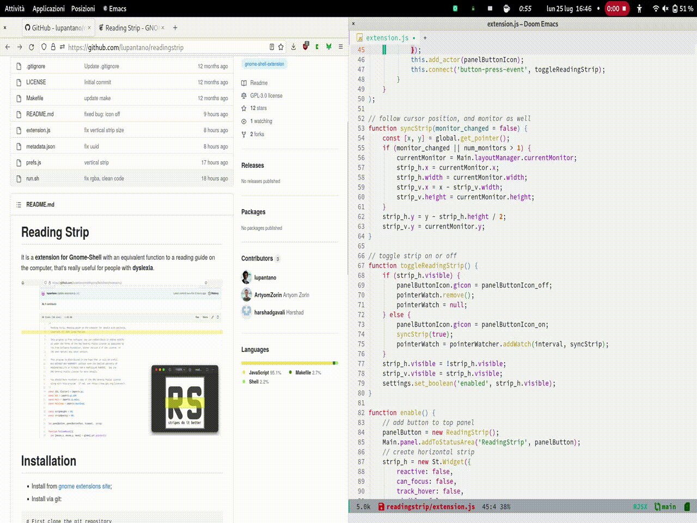
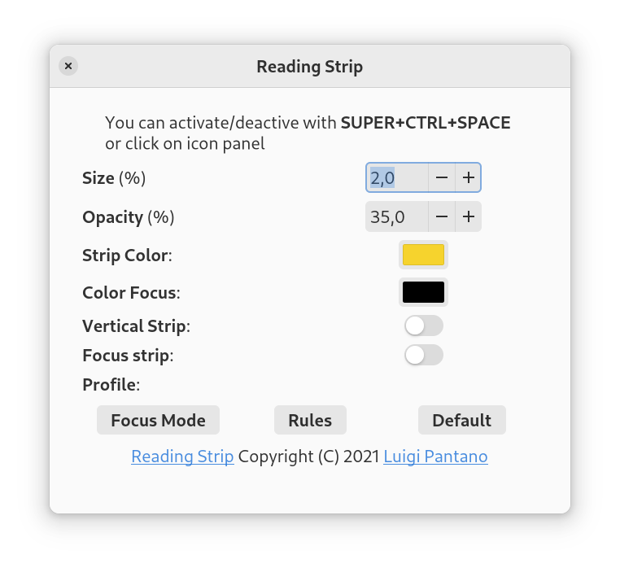

[](LICENSE)

# Reading Strip
It’s an **extension for Gnome-Shell**. It works as a reading guide for computer and this is really useful for people affected by **dyslexia**. 
It works great in **helping children focusing to read** very well, it marks the sentence that they are reading and hides the previous and the next one. It's already used in **education projects** at schools, it puts the attention on screen but it's also really useful for **programmers and graphic** designers who want to check their works.

**Features**:
- **horizontal strip**: function to a reading guide on the screen.
- **vertical strip**: this is really useful for graphic designers who want to check if their margins and indentations line up properly when displayed on the screen.
- **focus strip**: try it :-D;
- **strip preferences**: color, transparency, size.
- **profile**: try it :-D;




# Installation
* Install from [gnome extensions site](https://extensions.gnome.org/extension/4419/reading-strip/);
* Install via git:
```
# First clone the git repository
git clone https://github.com/lupantano/readingstrip.git

# install extension
cd readingstrip && make
```

After cloning the repo, the extension is practically installed yet disabled. In order to enable it, you need to use gnome-extensions-app - find the extension, titled 'Reading Strip', in the 'Extensions' screen and turn it 'On'.

# Use
You can activate/deactive with **Super+Ctrl+space**, **Super+space** or click on icon panel.

# Settings


```
cd ~/.local/share/gnome-shell/extensions/readingstrip@lupantano.gihthub

# height 1:100, default = 2
gsettings --schemadir schemas/ set org.gnome.shell.extensions.readingstrip height 2

# opacity 1:100, default = 35
gsettings --schemadir schemas/ set org.gnome.shell.extensions.readingstrip opacity 35

# color-strip  rgb(0,0,0): rgb(255,255,255), default = rgb(246,211,45)
gsettings --schemadir schemas/ set org.gnome.shell.extensions.readingstrip color-strip rgb(246,211,45)
```

# TODO
- [ ] Preferences: strip's color like default color theme;
- [x] Preferences: add focus mode;
- [ ] Preferences: add blur on not focused window 
- [x] Preferences: add vertical stripe;
- [ ] Preferences: add shortcuts change;
- [ ] Preferences: user profile (color, opacity, etc);
- [ ] Preferences: change cursor icon;
- [ ] Preferences focus mode: resize (h x w), color;
- [ ] Daltonism features;
- [ ] Preferences: hold on/off the strip;
- [x] Preferences: color button;
- [x] Preferences GUI;
- [X] Preferences: profiles;
- [x] Language: IT, EN, DE, ES, FR, 🇺🇦, 🇧🇷

# Contributors
@justperfection
@harshadgavali
@artyomzorin
