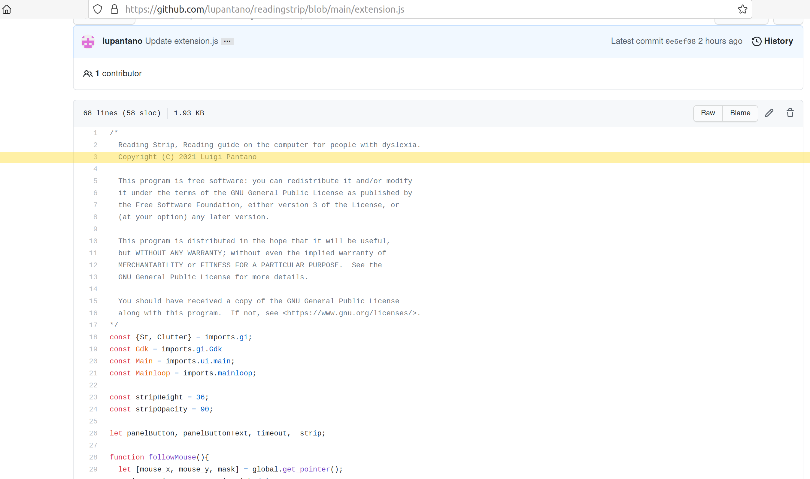

# Reading Strip
It is a **extension for Gnome-Shell** with an equivalent function to a reading guide on the computer, that's really useful for people with **dyslexia**.



# Installation

Installation via git is performed by cloning the repo into your local gnome-shell extensions directory (usually ~/.local/share/gnome-shell/extensions/):
```
git clone https://github.com/lupantano/readingstrip.git <extensions-dir>/readingstrip@lupantano.gihthub
```

After cloning the repo, the extension is practically installed yet disabled. In order to enable it, you need to use gnome-tweak-tool - find the extension, titled 'Reading Strip', in the 'Extensions' screen and turn it 'On'. You may need to restart the shell (Alt+F2 and insert 'r' in the prompt) for the extension to be listed there.

# Latest News
- 0.20210729: initial commit.

# TODO
- [x] improve performance;
- [ ] detect width screen;
- [ ] Icon panel
- [ ] check gnome 40 compatibility;

- [ ] Preferences: color;
- [ ] Preferences: height;
- [ ] Preferences: opacity;
- [ ] Preferences: shortcuts actiave/deactivate;
- [ ] Preferences: Languages;

- [ ] save/restore strip position.

# Contributors
@justperfection:gnome.org
